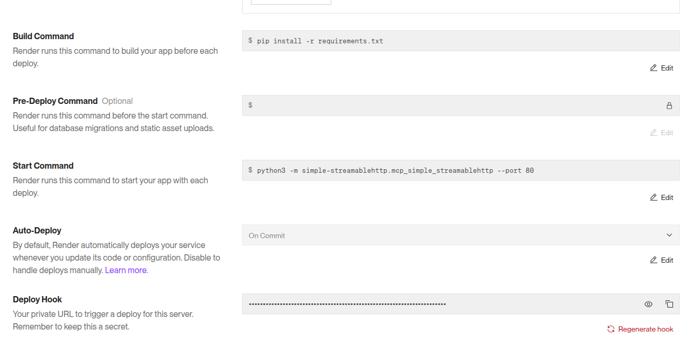

# Test-MCP-Servers 
This repo provides a method to run the test servers from the python sdk.

## Install

create a virtual environment and install the requirements

```bash
python3 -m venv .venv
source .venv/bin/activate
pip install -r requirements.txt
cd identity-streamablehttp; pip install -e .;cd ..
cd identity-streamablehttp; pip install -e .;cd ..
cd simple-streamablehttp; pip install -e .;cd ..
cd simple-streamablehttp-stateless; pip install -e .;cd ..
cd simple-prompt; pip install -e .;cd ..
cd simple-resource; pip install -e .;cd ..
cd simple-tool; pip install -e .;cd ..
```

## Run

```bash
# python -m simple-streamablehttp.mcp_simple_streamablehttp --log-level DEBUG --port 80 - dont use this use this....
#mcp-simple-streamablehttp --port 8080
identity-streamablehttp --port 80
```

## Sync with python sdk

At present, you will need to manually copy the sdk code to this directory.
from https://github.com/modelcontextprotocol/python-sdk/tree/main/examples/servers

## Test

Deploy to render.com

